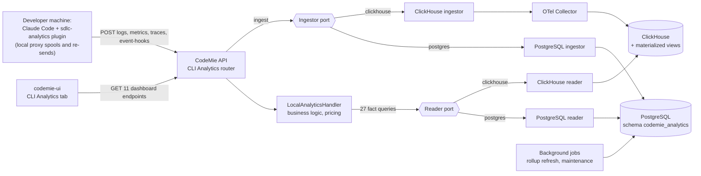
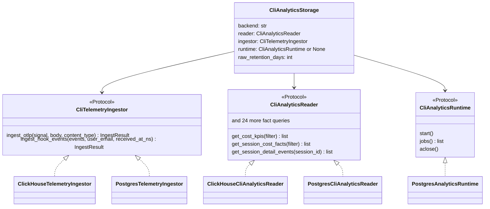
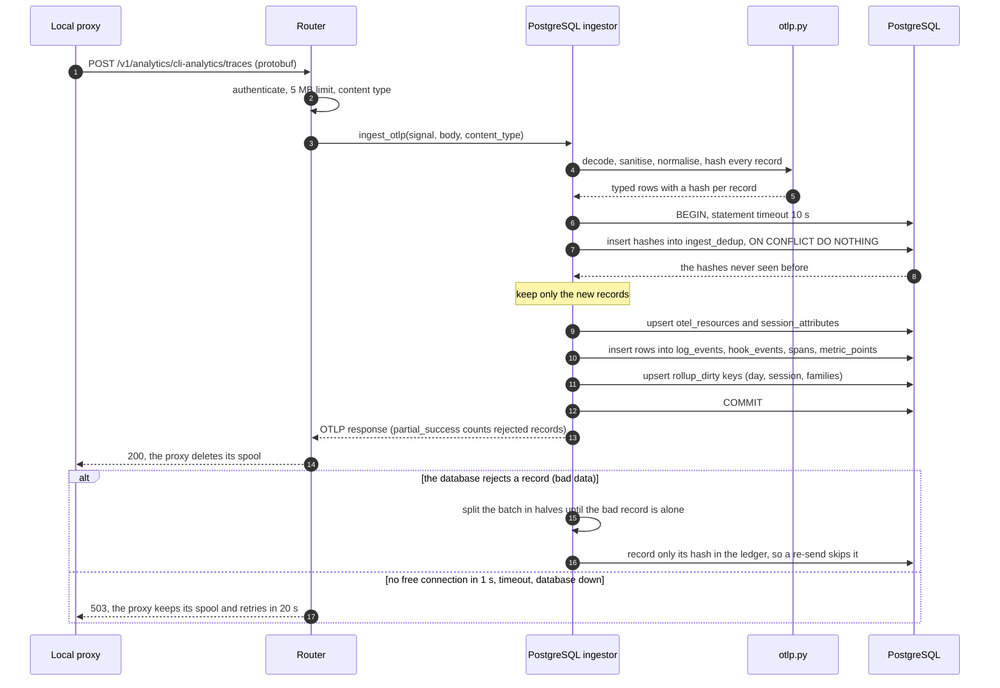
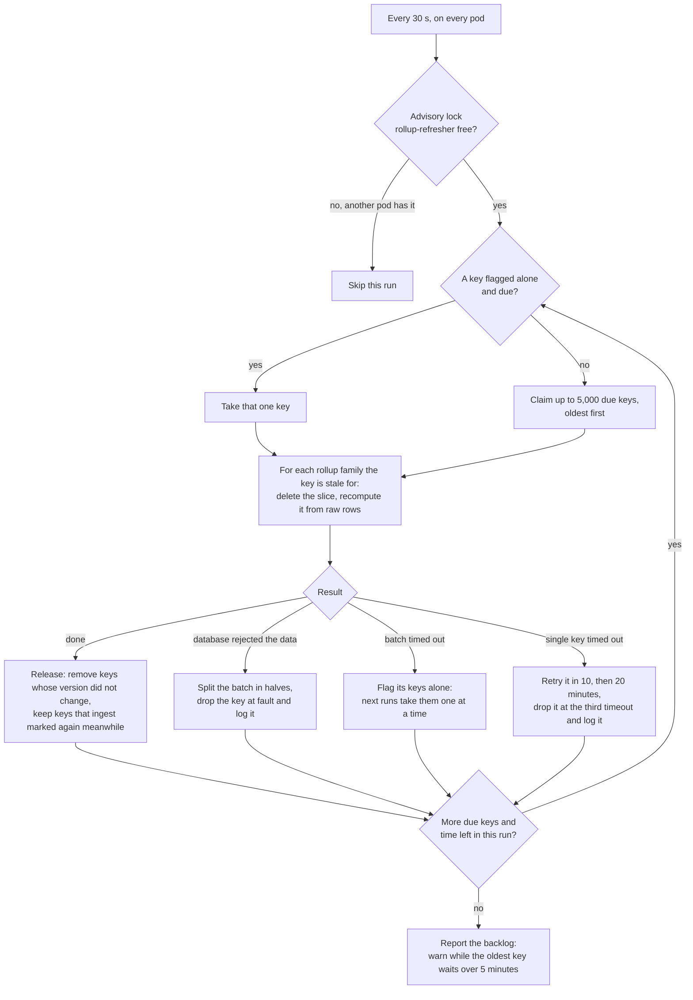
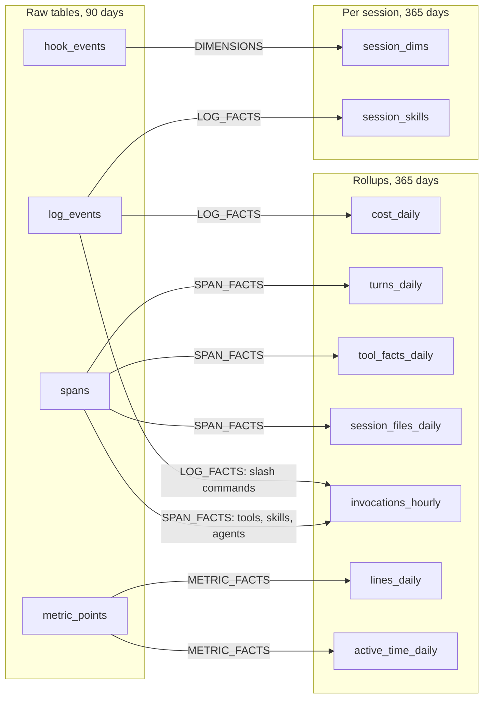
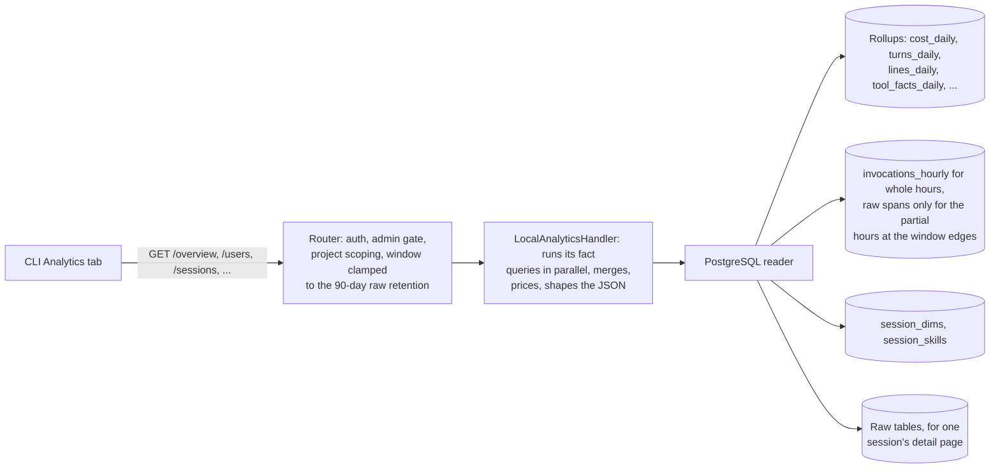
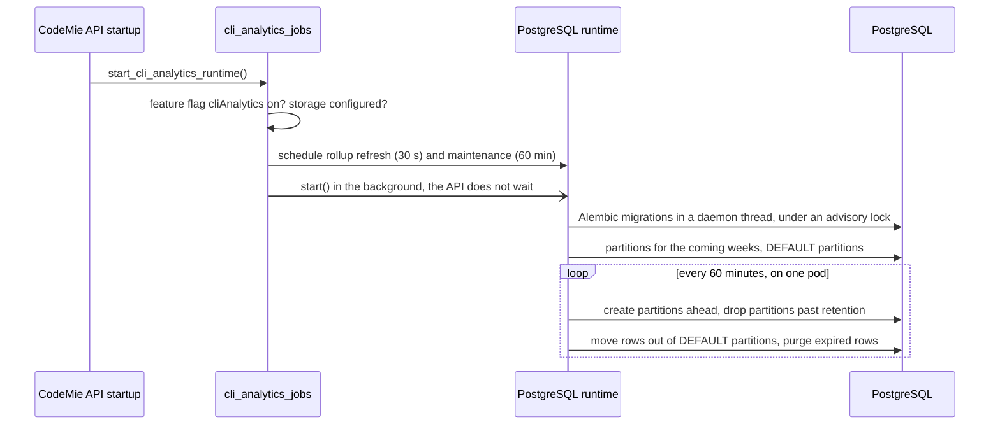

# Handoff: CLI Analytics on PostgreSQL

**Audience:** backend engineers who will review, deploy and keep improving CLI Analytics storage
**Ticket:** [EPMCDME-15253](https://jiraeu.epam.com/browse/EPMCDME-15253) · **Branch:** `EPMCDME-15253_cli-analytics-postgres-storage` (not merged)
**Status:** implemented and tested end to end; ten review rounds, the last approved. The open
items and decisions are in [section 11](#11-known-limitations-and-open-decisions) and
[section 12](#12-next-steps-to-production).
**Last validated:** 2026-09-24, on the final code

**Related documents**

| Document | Use it for |
| --- | --- |
| [Design doc](../specs/2026-09-23-cli-analytics-postgres-storage-design.md) | Why this design; options considered; proof-of-concept (PoC) evidence; §6.11 lists the deviations adopted during implementation |
| [Implementation plan](../plans/2026-09-23-cli-analytics-postgres-storage.md) | How the work was planned; every decision taken while building, with its reason |
| [Operations guide](../../../.ai-run/guides/integration/cli-analytics-storage.md) | Settings in full, the URL rules, alerts, backfill, test commands |
| This handoff | How it all fits together, in plain words, with pictures and numbers |

---

## 1. In short

- **What:** CLI Analytics stores telemetry from the `sdlc-analytics` plugin: Claude Code sends
  OTLP logs, traces and metrics, and the plugin's hooks send hook events. The data feeds the
  "CLI Analytics" tab in codemie-ui. Until now the only storage was ClickHouse, fed through the
  OTel Collector.
- **Change:** storage now sits behind **ports** (interfaces), with two **adapters**: ClickHouse
  (the default, unchanged behaviour) and **PostgreSQL** (new). One setting,
  `CLI_ANALYTICS_STORAGE_BACKEND=clickhouse|postgres`, picks the adapter.
- **Why PostgreSQL:** a deployment can run CLI Analytics with no ClickHouse and no Collector. It
  works on managed PostgreSQL 14+ with no extensions: RDS, Aurora, Azure Flexible Server, Cloud
  SQL, AlloyDB.
- **Same API:** all 11 dashboard endpoints return the same JSON on both engines, verified by
  comparing every endpoint on identical data in both (section 9.4).
- **Trade-offs:**
  - storage is about 20× bigger than ClickHouse;
  - dashboards lag ingest by up to about 30 s, the rollup refresh interval;
  - every query exists twice, once per engine.

---

## 2. The big picture



In words:

1. The plugin's local proxy collects telemetry per session and POSTs it to the API. It keeps a
   spool file and re-sends everything until it gets a 2xx. Only 401 and 403 stop it.
2. The router checks authentication, body size and content type, then hands the body to the
   **ingestor port**.
3. The UI calls the dashboard endpoints. The router applies access rules, and the shared
   **handler** asks the **reader port** for facts, then merges and prices them.
4. The factory builds exactly one adapter per process, from `CLI_ANALYTICS_STORAGE_BACKEND`.
   Nothing branches on the engine at request time.

---

## 3. Ports and adapters

Code: [`src/codemie/repository/cli_analytics/`](../../../src/codemie/repository/cli_analytics/)



| Piece | File | What it does |
| --- | --- | --- |
| Ports | [`ports.py`](../../../src/codemie/repository/cli_analytics/ports.py) | The three interfaces above, the `IngestResult` and `ScheduledJob` types, and the errors the router maps to HTTP statuses |
| Factory | [`factory.py`](../../../src/codemie/repository/cli_analytics/factory.py) | Builds the configured adapter lazily, once per process; `get_cli_analytics_storage()` |
| Filters | [`filters.py`](../../../src/codemie/repository/cli_analytics/filters.py) | `LocalAnalyticsFilter`, shared by both readers; `deny_all` replaces the old NUL sentinel (defect D5) |
| Vocabulary | [`vocabulary.py`](../../../src/codemie/repository/cli_analytics/vocabulary.py) | Maps a harness's span, event and metric names to canonical kinds. A new harness (Cursor, Codex, ...) is new entries here, not new queries |
| Hook events | [`hook_events.py`](../../../src/codemie/repository/cli_analytics/hook_events.py) | Normalises `/event-hooks` NDJSON for both adapters |
| ClickHouse adapter | [`clickhouse/`](../../../src/codemie/repository/cli_analytics/clickhouse/) | Today's queries (plus deterministic ordering fixes) and today's forwarding to the Collector |
| PostgreSQL adapter | [`postgres/`](../../../src/codemie/repository/cli_analytics/postgres/) | Section 4 |
| Jobs | [`cli_analytics_jobs.py`](../../../src/codemie/service/analytics/cli_analytics_jobs.py) | Schedules the adapter's jobs (APScheduler) and ties them to app startup and shutdown |

**The rule that keeps the engines in step:** a new or changed fact query goes into the port and
both readers in the same merge request, with a test for each, and both must keep returning the
same answers. The handler, the router and the response
models are shared, so business logic lives in one place.

---

## 4. The PostgreSQL adapter, module by module

Code: [`src/codemie/repository/cli_analytics/postgres/`](../../../src/codemie/repository/cli_analytics/postgres/)

| Module | Responsibility |
| --- | --- |
| [`settings.py`](../../../src/codemie/repository/cli_analytics/postgres/settings.py) | Turns `CLI_ANALYTICS_*` settings into one validated configuration. Reads the database URL once, strictly, and rebuilds a URL per driver (asyncpg for the pool, psycopg2 for migrations) so both reach the same database as the same user. Refused URLs never appear in messages |
| [`engine.py`](../../../src/codemie/repository/cli_analytics/postgres/engine.py) | A dedicated asyncpg connection pool (8 per pod by default), never the application's pool. Every session gets `search_path`, `work_mem=32MB`, `statement_timeout`, `jit=off`. Also advisory locks and IAM tokens |
| [`otlp.py`](../../../src/codemie/repository/cli_analytics/postgres/otlp.py) | Pure functions, no I/O: OTLP protobuf/JSON and hook events become typed rows. Strips NUL, repairs broken Unicode, caps implausible values, hashes each record for deduplication |
| [`ingestor.py`](../../../src/codemie/repository/cli_analytics/postgres/ingestor.py) | One transaction per request: dedup ledger, raw inserts, dirty keys. Isolates records the database rejects. Answers with OTLP responses |
| [`dirty.py`](../../../src/codemie/repository/cli_analytics/postgres/dirty.py) | The contract between ingest and refresh: which `(day, session)` slices new rows make stale, and which rollup families |
| [`rollups.py`](../../../src/codemie/repository/cli_analytics/postgres/rollups.py) | The refresher: recomputes stale rollup slices from raw rows, safely under concurrent ingest. It replaces ClickHouse's materialized views |
| [`reader.py`](../../../src/codemie/repository/cli_analytics/postgres/reader.py) | The 27 fact queries. Normalises driver types to the same Python types the ClickHouse reader returns |
| [`maintenance.py`](../../../src/codemie/repository/cli_analytics/postgres/maintenance.py) | Partitions ahead of time, retention drops, moving rows out of DEFAULT partitions, purges |
| [`runtime.py`](../../../src/codemie/repository/cli_analytics/postgres/runtime.py) | Startup (migrations in the background), the two jobs, the stale-queue warning, shutdown |
| [`migrations.py`](../../../src/codemie/repository/cli_analytics/postgres/migrations.py) + [`alembic_cli_analytics/`](../../../src/external/alembic_cli_analytics/) | A separate Alembic environment with its own version table in the analytics schema: `env.py` and one migration, the initial schema. Migrations run only through `run_migrations()`, so there is no `alembic.ini`; a new migration is a new file in `versions/` with `revision` and `down_revision` set |
| [`backfill.py`](../../../src/codemie/repository/cli_analytics/postgres/backfill.py) | Operator command: rebuild the rollups of a date range, for example after a vocabulary change |

---

## 5. How data flows

### 5.1 Write path: one request, one transaction



The ideas behind it, in plain words:

- **Exactly once.** The plugin re-sends whole spools, and after a failure it re-sends a growing
  batch. Every record therefore gets a 64-bit hash (spans: trace and span id; hook events: the
  event's content). The `ingest_dedup` ledger keeps each hash for 14 days, and only records whose
  hash is new are stored. ClickHouse today stores duplicates twice (design defect D6).
- **Fast answers.** The plugin gives up after 2 s and then drops events for 30 minutes. So
  ingest fails fast with a 503 instead of waiting: the pool wait is capped at 1 s and the
  transaction at 10 s. The proxy retries a 503 on its own.
- **Bad data never blocks a client.** A record PostgreSQL refuses (for example an unrepairable
  value) is dropped and logged. Its hash goes into the ledger, and the rest of the request is
  stored with a 200. A 4xx would make the proxy re-send the same spool forever. One request
  spends at most 64 attempts on isolating bad records; past that it answers 503, and the re-send
  carries on from what was already stored.
- **Rollups are not touched here.** Ingest only queues `(day, session)` keys in `rollup_dirty`.
  The refresher (5.2) does the aggregation, so concurrent requests never fight over rollup rows.

### 5.2 Rollup refresh: making dashboards fast

Dashboards read pre-aggregated **rollup** tables, not millions of raw rows. ClickHouse keeps them
up to date with materialized views; PostgreSQL uses a job.



Which raw rows feed which rollups. The labels are the rollup families in
[`dirty.py`](../../../src/codemie/repository/cli_analytics/postgres/dirty.py); partitioning is in [section 6](#6-data-model):



**Why nothing is lost while ingest keeps writing:** each queued key has a version, and ingest
bumps it when it marks the key again. The refresher deletes a key only if its version is still
the one it claimed, and it takes row locks in the same order ingest does. A key marked during a
recompute therefore stays queued, and the next run picks it up. Tests compare the incrementally
maintained rollups with a full recompute from raw after concurrent ingest: they are equal.

**Freshness:** new data shows up after the next refresh, 30 s by default. The UI also caches
responses for up to 5 minutes (`Cache-Control: private, max-age=300`).

### 5.3 Read path: a dashboard request



The techniques that made PostgreSQL fast enough, measured in the PoC at about 480 users (design §6.6):

| Technique | Effect at about 480 users, 30-day window |
| --- | --- |
| Hourly rollup for the inside of the window; raw spans only for the partial hours at both edges (results stay exact) | 1.75–1.95 s down to 32–84 ms |
| `last_active` from `session_dims` instead of scanning raw hook events | 863 ms down to 33 ms |
| `session_skills` table instead of looking up every session id in raw rows | 1.3 s down to 142 ms, and no more `/dev/shm` overflow |
| `work_mem=32MB` on analytics sessions | `/overview` 993 down to 763 ms, `/users` 783 down to 471 ms |
| `jit=off` on analytics sessions | about 500 ms less on a 3 ms session-detail query |

### 5.4 Startup, background jobs and maintenance



- **The app always starts.** A refused configuration is logged and the analytics endpoints
  answer 503. An unreachable database is also only logged: the next job run retries the
  migration.
- **One pod at a time:** each job holds a session advisory lock on the analytics database, so
  this works even when the analytics tables live in another database.
- **Partitions:** raw tables get weekly partitions, created 4 weeks ahead. Rollups get monthly
  and the ledger daily. Every table also has a DEFAULT partition as a safety net: rows that land
  there are logged and moved out once their partition exists. Retention drops whole partitions,
  so there is no `DELETE` and no vacuum debt.

---

## 6. Data model

17 tables in schema `codemie_analytics`, created by the migration in
[`src/external/alembic_cli_analytics/versions/`](../../../src/external/alembic_cli_analytics/versions/).

| Group | Tables | Partitioning, retention | Notes |
| --- | --- | --- | --- |
| Raw telemetry | `log_events`, `hook_events`, `spans`, `metric_points` | weekly, 90 days | Typed columns for what queries use; the rest goes in a JSONB `attrs` column. A small-integer `span_kind` or `event_kind` is set at ingest from the vocabulary |
| Shared attributes | `otel_resources`, `session_attributes` | none; purged when unused for 90 days | Resource and session-constant attributes are stored once, not on every row. This is one of the two main space savings |
| Ingest bookkeeping | `ingest_dedup`, `rollup_dirty` | ledger daily, 14 days; queue not partitioned | The exactly-once ledger and the refresher's work queue (with `version`, `alone`, `timeouts`) |
| Daily and hourly rollups | `cost_daily`, `turns_daily`, `lines_daily`, `active_time_daily`, `tool_facts_daily`, `session_files_daily`, `invocations_hourly` | monthly, 365 days | Same grain as the ClickHouse rollups |
| Per session | `session_dims`, `session_skills` | not partitioned; rows purged after 365 days | Session dimensions (repository, branch, project, ...) and identity; skills used |

Why typed columns and not a ClickHouse-style JSON mirror: PostgreSQL compresses a value only when
its row is over about 2 KB, and telemetry rows are 200–1,100 bytes. The only lever is what goes
into a row. Typed columns plus shared attributes stored once came to about 405 bytes per row; a
generic JSONB layout took about 1,080 (design §5.2).

---

## 7. Configuration

The feature needs `features:cliAnalytics` enabled (`config/customer/customer-config.yaml`, or
`FEATURE_CLI_ANALYTICS=true`). The storage settings are below; the full table and every URL rule
are in the [operations guide](../../../.ai-run/guides/integration/cli-analytics-storage.md#postgresql-settings).

| Setting | Default | In plain words |
| --- | --- | --- |
| `CLI_ANALYTICS_STORAGE_BACKEND` | `clickhouse` | `postgres` switches to the new adapter |
| `CLI_ANALYTICS_PG_URL` | empty: the application database | Point it at a separate database for bigger installs (above about 200 active users). Percent-encode special characters in the user name and password |
| `CLI_ANALYTICS_PG_SCHEMA` | `codemie_analytics` | Where all tables live |
| `CLI_ANALYTICS_PG_POOL_SIZE` | `8` | Connections per pod, separate from the application pool |
| `CLI_ANALYTICS_PG_STATEMENT_TIMEOUT_MS` / `..._INGEST_STATEMENT_TIMEOUT_MS` | `30000` / `10000` | Dashboard query limit / ingest transaction limit |
| `CLI_ANALYTICS_PG_INGEST_ACQUIRE_TIMEOUT_MS` | `1000` | Answer 503 instead of queueing past the plugin's 2 s limit |
| `CLI_ANALYTICS_PG_WORK_MEM` | `32MB` | Memory per sort or hash on analytics sessions |
| `CLI_ANALYTICS_RAW_RETENTION_DAYS` / `..._ROLLUP_RETENTION_DAYS` / `..._DEDUP_RETENTION_DAYS` | `90` / `365` / `14` | How long raw rows, rollups and dedup hashes are kept |
| `CLI_ANALYTICS_ROLLUP_REFRESH_SECONDS` / `..._ROLLUP_BATCH_SIZE` | `30` / `5000` | Dashboard freshness; keys per refresh transaction |
| `CLI_ANALYTICS_PARTITION_PREMAKE_WEEKS` / `..._MAINTENANCE_INTERVAL_MINUTES` | `4` / `60` | Partitions created ahead; maintenance period |

Deployment rules worth knowing up front:

- **Connections:** use a direct or session-pooled connection. PgBouncer transaction mode breaks
  the advisory locks, the session settings and asyncpg's prepared statements.
- **Database role:** it needs DDL on its schema, DML on its tables and `TEMPORARY` on the
  database. A DBA may create the schema instead.
- **IAM:** the same providers as the application (`PG_IAM_AUTH_PROVIDER`). A URL without a
  password authenticates with a fresh token; for AWS, the URL must name a network host and a user.

---

## 8. Reliability: what happens when things go wrong

| Situation | What the PostgreSQL adapter does | Client sees |
| --- | --- | --- |
| Duplicate or re-sent data | Ledger drops records already stored (14-day window) | 200; stored once |
| Database down, slow, or pool busy | Fails fast (1 s pool wait, 10 s transaction limit) | 503; the proxy keeps its spool and retries every 20 s |
| A record the database rejects | Isolated by halving, dropped, logged, entered in the ledger | 200 with OTLP `partial_success` (503 after 64 isolation attempts; the re-send carries on) |
| Configuration refused, for example an unreadable URL | Logged at startup; the application starts anyway | 503 on every analytics endpoint |
| Database unreachable from a dashboard (network, TLS, timeout) | Logged | 503 |
| Refresher stopped or behind | Raw data keeps arriving; warning every 5 minutes while the oldest key waits over 5 minutes | Dashboards go stale, then catch up on their own |
| A rollup key too slow to recompute | Taken alone, retried after 10 then 20 minutes, dropped at the third timeout (logged) | The other keys are not held up |
| A row outside every partition | Lands in DEFAULT, logged, moved out when its partition exists | Nothing |
| Implausible values (tokens above 10^9, cost beyond ±10^6 USD, spans over 30 days) | Treated as unparseable (0), original kept in `attrs` | Sums can never overflow |

All alertable log lines are listed in the
[operations guide](../../../.ai-run/guides/integration/cli-analytics-storage.md#operations).

---

## 9. Performance and evaluation

### 9.1 Targets (design §3)

| Attribute | Target |
| --- | --- |
| Ingest latency | p99 < 500 ms per request at peak (the plugin's hard limit is 2 s) |
| Ingest throughput | at least 10× the estimated peak for 500 active users on one pod. Peak is about 60 requests/s, or about 3,400 records/s |
| Dashboard latency | p95 < 1 s per endpoint for a 30-day window at about 500 users; session detail < 200 ms |
| Freshness | new events visible within 60 s |
| Correctness | each record stored once under retries; rollups equal a full recompute from raw |
| Retention | raw 90 days, rollups 365 days, configurable |

### 9.2 What the design-phase PoC measured (design §1 and §7)

The PoC ran on a laptop Docker VM (2 vCPU, 3.8 GB RAM, default PostgreSQL settings). The ×12
data set was 28,524 sessions in 30 days and about 14 M records, or about 480 users.

| Question | Result |
| --- | --- |
| Same API output? | 381 endpoint scenarios through the unchanged handler: 379 byte-identical, 2 differing only in the order of two rows with the same timestamp |
| Ingest, 8 concurrent writers | 701 requests/s, 38,843 records/s, p99 32.7 ms |
| Ingest, 1 connection | 7,511 records/s, p99 17.4–26.1 ms per request |
| Dashboards at ×12, `work_mem=32MB` | 7-day window 10–202 ms; 30-day window up to 825 ms (`/sessions`); session detail 34 ms |
| Rebuilding all rollups | 26,367 session-days in 91 s |
| Storage | about 406 B per raw record with indexes, vs about 23 B in ClickHouse (about 20× more) |

Projected storage: 90 days of raw data plus 365 days of rollups, at the synthetic rate of about
940 records per user per day.

| Active users | PostgreSQL total | ClickHouse total |
| --- | --- | --- |
| 100 | 4.2 GB | 0.2 GB |
| 500 | 21.1 GB | 1.0 GB |
| 2,000 | 84.3 GB | 4.1 GB |

Measure the real records per user per day on production ClickHouse before sizing; the query is
in design §7.5.

### 9.3 What the implementation measured

These runs used production defaults and the production code paths: 8 writers through the real
ingestor, the refresher running every 30 s under its lock, and endpoints timed through the real
handler.

| Run | Ingest | 30-day dashboards | Notes |
| --- | --- | --- | --- |
| **×1, final code, 2026-09-24**: 40 developers × 31 days, 1.49 M records, 2,988 sessions in 30 days | 30,006 records/s (531 requests/s); per request p50 13.9 ms, p95 24.9 ms, p99 35.5 ms; no errors | medians 5–72 ms; single-user overview 18 ms | Session detail median 25 ms. The refresher kept up: the queue was 20 s old at the end of ingest and drained within the next run |
| ×3 (plan, Task 14): 120 developers, 8,221 sessions in 30 days | 21.5k records/s; p99 51–62 ms; no errors | medians 15–285 ms, max 327 ms | `/overview` grows linearly, which projects to about 0.8 s at ×12 (as the PoC measured). Refresh rebuilt about 505 session-days/s |
| Live API, full middleware stack | 113 requests/s, p99 about 320 ms | | Includes authentication and logging middleware |

×1 endpoint latency on the final code, median of 7 runs, in ms:

| Endpoint | 7-day | 30-day |
| --- | --- | --- |
| overview | 26 | 62 |
| cost | 4 | 14 |
| users (page of 50) | 16 | 43 |
| user-charts | 13 | 43 |
| repositories (page of 10) | 14 | 48 |
| repositories (all rows) | 13 | 46 |
| tools | 5 | 13 |
| activity | 2 | 5 |
| efficiency | 13 | 41 |
| sessions (page of 20) | 20 | 72 |
| sessions sorted by cost | 21 | 66 |
| overview, one user | 13 | 18 |

**One operational finding from this run.** Right after a bulk load, the new partitions had no
planner statistics yet, and the single-user overview took 192 ms instead of 18 ms. Autovacuum
analyzes new partitions on its own within minutes. The same numbers with only the partitions
analyzed confirmed that the parent tables' statistics do not matter here. After a backfill or
a bulk migration, run `ANALYZE` on the analytics schema, or wait a few minutes.

### 9.4 How correctness was evaluated

| Evaluation | Result |
| --- | --- |
| **Both engines on identical data.** 12 users × 62 days loaded into ClickHouse (the way the Collector writes it) and PostgreSQL; every windowed endpoint × 5 windows × 6 filter sets (300 answers), 17 session-list variants and 65 session-detail pages compared | Identical JSON (floats to 1e-9). The first comparison also found a ClickHouse ordering bug (D11), fixed test-first |
| **API end to end, once per backend** | Telemetry sent through HTTP comes back from every endpoint with totals equal to what was sent |
| **Exactly once** | Replayed and grown batches are stored once; rollups equal a full recompute after concurrent ingest |
| **Failure modes** | Database down gives 503; pool saturation gives a fast 503; a request stuck behind a lock gives 503, leaves nothing behind, and its retry stores once |
| **Every reader query against known answers** | Exact expected values for all 27 methods, including window edges and time zones |
| **Schema and maintenance on a real database** | Migrations, partitions, retention, the DEFAULT-partition path, a restricted database role |
| **URL handling against the real drivers' parsers** | The pool and the migrations connect as the same user to the same database ([`test_settings.py`](../../../tests/codemie/repository/cli_analytics/postgres/test_settings.py)) |
| **Live system** | Real HTTP ingest on a running backend, the refresher draining the queue, API totals equal to raw aggregates, the UI's own requests answered |

Results on the final code, 2026-09-24:

- **Unit tests:** 17,030 passed in the full suite. 214 tests fail on the development machine
  used, the same set that fails on a clean checkout of `main` there (its `.env.local` leaks into
  tests); none relates to this change.
- **Against real PostgreSQL and ClickHouse:** all 180 checks passed.
- **Lint:** Ruff and the license-header check are clean.
- **Code review:** ten rounds; every finding was fixed test-first, and the last round approved.

---

## 10. Working with it

### 10.1 Run locally on PostgreSQL

```bash
# .env or .env.local:
#   CLI_ANALYTICS_STORAGE_BACKEND=postgres
#   CLI_ANALYTICS_PG_URL=postgresql://<user>:<password>@localhost:5432/codemie_analytics   (optional)
docker exec postgres psql -U postgres -c "CREATE DATABASE codemie_analytics"   # only with a dedicated URL
make run FEATURE_CLI_ANALYTICS=true
```

The schema is created on startup. Point the plugin, or any OTLP sender, at
`http://localhost:8080/v1/analytics/cli-analytics/{logs,metrics,traces,event-hooks}`.

### 10.2 Tests

| Suite | How |
| --- | --- |
| Unit tests (default gate) | `make test` |

The unit tests need no database. SQL, schema and engine-to-engine behaviour were verified against
real PostgreSQL and ClickHouse servers (section 9.4).

### 10.3 Operate

- **Backfill or repair rollups:** `python -m codemie.repository.cli_analytics.postgres.backfill --from YYYY-MM-DD --to YYYY-MM-DD [--now]`.
- **Adding a harness:** add its names to `vocabulary.py`. Rows stored before the names existed
  keep kind 0 until a backfill re-derives them.
- **Watch these log lines:** a stale rollup queue, `dropped rollup key`, maintenance errors,
  rows in DEFAULT partitions, dropped telemetry records. The full list is in the
  [operations guide](../../../.ai-run/guides/integration/cli-analytics-storage.md#operations).
- **Topology:** a separate schema on the application's cluster is fine for small installs.
  Above about 200 active users, or when analytics outgrows the main database, use a separate
  database or instance, so vacuum, backups and I/O don't compete.

---

## 11. Known limitations and open decisions

**Decisions needed from the team** (design §10 and §6.11):

1. **Sign-off on design §6.11:** the deviations adopted while building. Examples: log lines
   instead of metrics, blake2b instead of xxh64, a versioned claim in the refresher, stricter
   URL rules.
2. **D2:** sessions without plugin data sort on a "1970" start time on both engines. Fix it in
   both engines, or keep it for parity.
3. **Default topology:** the same cluster or a separate database from the start
   (recommended: a separate database on the same cluster).
4. **Freshness:** is up to about 60 s acceptable, or should the refresh interval drop to 5–10 s?
5. **Raw data no endpoint reads** (`llm_request` spans, raw metric points): keep it for 90 days,
   or shorten its retention to save space.
6. **Plugin follow-ups** (separate repository): stop retrying 4xx forever and cap the re-sent
   batch size (defect D7). This affects both engines.

**Known limitations, by design or deferred:**

- Storage is about 20× ClickHouse; PostgreSQL cannot compress rows this small (section 6).
- Dashboards are eventually consistent: up to one refresh interval behind ingest.
- Observability is **log lines only**; there are no metrics or dashboards yet.
- `PG*` environment variables (`PGPORT`, `PGHOSTADDR`, `PGSERVICE`) can fill parts a URL leaves
  out, and the settings reader does not see them. With AWS IAM and `PGPORT` set, logins fail
  loudly.
- Parameter names libpq does not know are dropped and counted in a warning, not refused, so a
  reused `PG_URL` with driver-specific parameters keeps working. A misspelt name, such as
  `ssl_mode`, is therefore dropped too.
- Dashboards answer 500, not 503, for connection failures that are not network errors (for
  example too many connections, or a rejected IAM token). Ingest already answers 503 for them.
- Pre-existing behaviour kept for parity on both engines:
  - a dispatch with no matching parent shows a negative duration (D12);
  - OTLP logs carrying `event_type` can change a session's attribution (D13).
- The handler merges per-session results in Python (D8). This is fine at the measured scale;
  above a few thousand sessions per window, push that merge into SQL behind the same port.

---

## 12. Next steps to production

- [ ] Decide the open items in section 11 and get the §6.11 sign-off.
- [ ] Turn the log lines into alerts now; add real metrics later: ingest latency, rows per table,
      dedup hits, `rollup_dirty` size and age, refresher run time, rows in DEFAULT, table sizes.
- [ ] Load test at ×12 (about 500 users) on production-like hardware. The implementation was
      measured at ×1 and ×3 on a laptop VM with about 6 GB of free disk.
- [ ] Automate the engine comparison in CI (both engines in containers, the same data, every
      endpoint), nightly.
- [ ] Deployment configuration (Helm and environment): backend switch, analytics URL, role
      grants, session pooling, and a separate database above about 200 users.
- [ ] Size with real data: run the records-per-user query (design §7.5) on production ClickHouse.
- [ ] Look at every widget of the CLI Analytics tab on PostgreSQL in a signed-in browser. The
      page's own requests were verified; the rendered page was not.
- [ ] Decide the backup policy: analytics data can only be re-created from client spools, which
      are deleted after delivery.
- [ ] Optional: a ClickHouse → PostgreSQL migration tool (design Phase 5.3).

---

## 13. Where things are

| Area | Location |
| --- | --- |
| Ports, factory, shared pieces | `src/codemie/repository/cli_analytics/` |
| PostgreSQL adapter | `src/codemie/repository/cli_analytics/postgres/` |
| ClickHouse adapter | `src/codemie/repository/cli_analytics/clickhouse/` |
| Migrations | `src/external/alembic_cli_analytics/` |
| Jobs | `src/codemie/service/analytics/cli_analytics_jobs.py` |
| Router and handler (shared) | `src/codemie/rest_api/routers/cli_analytics.py`, `src/codemie/service/analytics/handlers/cli_analytics_handler.py` |
| Settings | `src/codemie/configs/config.py` (`CLI_ANALYTICS_*`) |
| Unit tests | `tests/codemie/repository/cli_analytics/`, plus the router, jobs, config and IAM tests |
| Test support (OTLP builders, port contract checks) | `tests/codemie/repository/cli_analytics/support/` |

---

## Glossary

| Term | Meaning |
| --- | --- |
| OTLP | OpenTelemetry's wire format. Claude Code sends logs, traces (spans) and metrics in it |
| Hook event | A plugin event such as a session start or a tool use, sent as NDJSON to `/event-hooks` |
| Port / adapter | An interface the application uses, and one engine's implementation of it |
| Rollup | A pre-aggregated table, for example cost per day per session. Dashboards read rollups, not raw rows |
| Dirty key | A `(day, session)` slice whose rollups are stale and must be recomputed |
| Refresher | The background job that recomputes dirty keys; PostgreSQL's replacement for materialized views |
| Ledger | `ingest_dedup`: the hashes of stored records, used to store each record exactly once |
| Partition | A slice of a table by time range (a week, a month, a day). Retention drops whole partitions |
| DEFAULT partition | A catch-all partition for rows outside every planned range; it should stay empty |
| Advisory lock | A PostgreSQL lock with a name; makes each job run on one pod at a time |
| Engine parity | Both engines return the same JSON for the same stored data |
